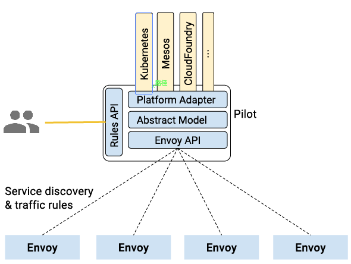

# ISTIO在微服务中的应用

今天的内容将会分成三个部分:

- 介绍： 让大家了解Istio是什么，以及有什么好处，以及Istio背后的开发团队
- 架构： 介绍Istio的整体架构和四个主要功能模块的具体功能，这块内容会比较偏技术
- 展望： 介绍Istio的后续开发计划，探讨未来的发展预期

## **介绍**

**Istio是什么：**

Istio是Google/IBM/Lyft联合开发的开源项目，2017年5月发布第一个release 0.1.0， 官方定义为:

**Istio：一个连接，管理和保护微服务的开放平台。**

按照isito文档中给出的定义:

> Istio提供一种简单的方式来建立已部署的服务的网络，具备负载均衡，服务到服务认证，监控等等功能，而**不需要改动任何服务代码**。

简单的说，有了Istio，你的服务就不再需要任何微服务开发框架（典型如Spring Cloud，Dubbo），也不再需要自己动手实现各种复杂的服务治理的功能（很多是Spring Cloud和Dubbo也不能提供的，需要自己动手）。只要服务的客户端和服务器可以进行简单的直接网络访问，就可以通过将网络层委托给Istio，从而获得一系列的完备功能。

可以近似的理解为：

**Istio = 微服务框架 + 服务治理**

**名字和图标：**

Istio来自希腊语，英文意思是”Sail”， 翻译为中文是“启航”。它的图标如下:

可以类比Google的另外一个相关产品：Kubernetes，名字也是同样起源于古希腊，是船长或者驾驶员的意思。下图是Kubernetes的图标： 

后面会看到，Istio和Kubernetes的关系，就像它们的名字和图标一样， 可谓”一脉相传”。 

**主要特性：**

Istio的关键功能:

- HTTP/1.1，HTTP/2，gRPC和TCP流量的自动区域感知负载平衡和故障切换。
- 通过丰富的路由规则，容错和故障注入，对流行为的细粒度控制。
- 支持访问控制，速率限制和配额的可插拔策略层和配置API。
- 集群内所有流量的自动量度，日志和跟踪，包括集群入口和出口。
- 安全的服务到服务身份验证，在集群中的服务之间具有强大的身份标识。

这些特性在稍后的架构章节时会有介绍。

## **为什么要使用Istio** 

在深入Istio细节之前，先来看看，为什么要使用Istio？它可以帮我们解决什么问题? 

### 微服务的两面性

最近两三年来微服务方兴未艾， 可以看到越来越多的公司和开发人员陆陆续续投身到微服务架构， 让一个一个的微服务项目落地。

但是，在这一片叫好的喧闹中， 我们还是发觉一些普遍存在的问题：虽然微服务对开发进行了简化，通过将复杂系统切分为若干个微服务来分解和降低复杂度，使得这些微服务易于被小型的开发团队所理解和维护。但是，复杂度并非从此消失。微服务拆分之后，单个微服务的复杂度大幅降低，但是由于系统被从一个单体拆分为几十甚至更多的微服务， 就带来了另外一个复杂度：微服务的连接、管理和监控。

试想， 对于一个大型系统， 需要对多达上百个甚至上千个微服务的管理、部署、版本控制、安全、故障转移、策略执行、遥测和监控等，谈何容易。更不要说更复杂的运维需求，例如A/B测试，金丝雀发布，限流，访问控制和端到端认证。

开发人员和运维人员在单体应用程序向分布式微服务架构的转型中， 不得不面临上述挑战。

### 服务网格

Service Mesh，服务网格，也有人翻译为”服务啮合层”.

这貌似是今年才出来的新名词？在2017年之前没有听过，虽然类似的产品已经存在挺长时间。

什么是Service Mesh（服务网格）？

- Service Mesh是专用的基础设施层。
- 轻量级高性能网络代理。
- 提供安全的、快速的、可靠地服务间通讯。
- 与实际应用部署一起，但对应用透明。

为了帮助理解， 下图展示了服务网格的典型边车部署方式：

图中应用作为服务的发起方，只需要用最简单的方式将请求发送给本地的服务网格代理，然后网格代理会进行后续的操作，如服务发现，负载均衡，最后将请求转发给目标服务。

当有大量服务相互调用时，它们之间的服务调用关系就会形成网格，如下图所示：

在上图中绿色方块为服务，蓝色方块为边车部署的服务网格，蓝色线条为服务间通讯。可以看到蓝色的方块和线条组成了整个网格，我们将这个图片旋转90°，就更加明显了：服务网格呈现出一个完整的支撑态势，将所有的服务”架”在网格之上： 

Istio也可以视为是一种服务网格， 在Istio网站上详细解释了这一概念：

如果我们可以在架构中的服务和网络间透明地注入一层，那么该层将赋予运维人员对所需功能的控制，同时将开发人员从编码实现分布式系统问题中解放出来。通常将这个统一的架构层与服务部署在一起，统称为“服务啮合层”。由于微服务有助于分离各个功能团队，因此服务啮合层有助于将运维人员从应用特性开发和发布过程中分离出来。通过系统地注入代理到微服务间的网络路径中，Istio将迥异的微服务转变成一个集成的服务啮合层。

### Istio能做什么?

Istio力图解决前面列出的微服务实施后需要面对的问题。

Istio 首先是一个服务网络，但是Istio又不仅仅是服务网格: 在 Linkerd， Envoy 这样的典型服务网格之上，Istio提供了一个完整的解决方案，为整个服务网格提供行为洞察和操作控制，以满足微服务应用程序的多样化需求。

Istio在服务网络中统一提供了许多关键功能(以下内容来自官方文档)：

- **流量管理：**控制服务之间的流量和API调用的流向，使得调用更可靠，并使网络在恶劣情况下更加健壮。
- **可观察性：**了解服务之间的依赖关系，以及它们之间流量的本质和流向，从而提供快速识别问题的能力。
- **策略执行：**将组织策略应用于服务之间的互动，确保访问策略得以执行，资源在消费者之间良好分配。策略的更改是通过配置网格而不是修改应用程序代码。
- **服务身份和安全：**为网格中的服务提供可验证身份，并提供保护服务流量的能力，使其可以在不同可信度的网络上流转。

除此之外，Istio针对可扩展性进行了设计，以满足不同的部署需要：

- **平台支持：**Istio旨在在各种环境中运行，包括跨云， 预置，Kubernetes，Mesos等。最初专注于Kubernetes，但很快将支持其他环境。
- **集成和定制：**策略执行组件可以扩展和定制，以便与现有的ACL，日志，监控，配额，审核等解决方案集成。

这些功能极大的减少了应用程序代码，底层平台和策略之间的耦合，使微服务更容易实现。

#### Istio的真正价值

上面摘抄了Istio官方的大段文档说明，洋洋洒洒的列出了Istio的大把大把高大上的功能。但是这些都不是重点！理论上说，任何微服务框架，只要愿意往上面堆功能，早晚都可以实现这些。

那，关键在哪里？

不妨设想一下，在平时理解的微服务开发过程中，在没有Istio这样的服务网格的情况下，要如何开发我们的应用程序，才可以做到前面列出的这些丰富多彩的功能? 这数以几十记的各种特性，如何才可以加入到应用程序?

无外乎，找个Spring Cloud或者Dubbo的成熟框架，直接搞定服务注册，服务发现，负载均衡，熔断等基础功能。然后自己开发服务路由等高级功能， 接入Zipkin等Apm做全链路监控，自己做加密、认证、授权。 想办法搞定灰度方案，用Redis等实现限速、配额。 诸如此类，一大堆的事情， 都需要自己做，无论是找开源项目还是自己操刀，最后整出一个带有一大堆功能的应用程序，上线部署。然后给个配置说明到运维，告诉他说如何需要灰度，要如何如何， 如果要限速，配置哪里哪里。

这些工作，相信做微服务落地的公司，基本都跑不掉，需求是现实存在的，无非能否实现，以及实现多少的问题，但是毫无疑问的是，要做到这些，绝对不是一件容易的事情。

问题是，即使费力做到这些事情到这里还没有完：运维跑来提了点要求，在他看来很合理的要求，比如说：简单点的加个黑名单， 复杂点的要做个特殊的灰度：将来自iPhone的用户流量导1%到Stagging环境的2.0新版本……

这里就有一个很严肃的问题， 给每个业务程序的开发人员: 你到底想往你的业务程序里面塞多少管理和运维的功能? 就算你hold的住技术和时间，你有能力一个一个的满足各种运维和管理的需求吗？ 当你发现你开始疲于响应各种非功能性的需求时，就该开始反省了: 我们开发的是业务程序，它的核心价值在业务逻辑的处理和实现，将如此之多的时间精力花费在这些非业务功能上， 这真的合理吗? 而且即使是在实现层面，微服务实施时，最重要的是如何划分微服务，如何制定接口协议，你该如何分配你有限的时间和资源？

Istio **超越 spring cloud和dubbo** 等传统开发框架之处， 就在于不仅仅带来了远超这些框架所能提供的功能， 而且也不需要应用程序为此做大量的改动， 开发人员也不必为上面的功能实现进行大量的知识储备。

总结:

**Istio 大幅降低微服务架构下应用程序的开发难度，势必极大的推动微服务的普及。**

个人乐观估计，随着isito的成熟，微服务开发领域将迎来一次颠覆性的变革。

后面我们在介绍Istio的架构和功能模块时, 大家可以了解到Istio是如何做到这些的。

**架构**

**整体架构**

Istio服务网格逻辑上分为**数据面板**和**控制面板**。

- **数据面板**由一组智能代理（Envoy）组成，代理部署为边车，调解和控制微服务之间所有的网络通信。
- **控制面板**负责管理和配置代理来路由流量，以及在运行时执行策略。

下图为Istio的架构详细分解图：

**Envory** 

以下介绍内容来自Istio官方文档：

> Istio 使用Envoy代理的扩展版本，Envoy是以C++开发的高性能代理，用于调解服务网格中所有服务的所有入站和出站流量。
>
> Istio利用了Envoy的许多内置功能，例如动态服务发现，负载均衡，TLS termination，HTTP/2&gRPC代理，熔断器，健康检查，基于百分比流量拆分的分段推出，故障注入和丰富的metrics。
>
> Envoy实现了过滤和路由、服务发现、健康检查，提供了具有弹性的负载均衡。它在安全上支持TLS，在通信方面支持gRPC.

概括说，Envoy提供的是服务间网络通讯的能力，包括(以下均可支持TLS)：

- HTTP／1.1
- HTTP/2
- gRPC
- TCP

以及网络通讯直接相关的功能：

- 服务发现：从Pilot得到服务发现信息
- 过滤
- 负载均衡
- 健康检查
- 执行路由规则(Rule): 规则来自Polit,包括路由和目的地策略
- 加密和认证: TLS certs来自 Istio-Auth

此外, Envoy 也吐出各种数据给Mixer:

- Metrics
- Logging
- Distribution Trace: 目前支持 Zipkin

总结: Envoy是Istio中负责”干活”的模块,如果将整个Istio体系比喻为一个施工队,那么 Envoy 就是最底层负责搬砖的民工，所有体力活都由Envoy完成。所有需要控制，决策，管理的功能都是其他模块来负责，然后配置给Envoy。

**Pilot**

- 流量管理

Istio最核心的功能是流量管理，前面我们看到的数据面板，由Envoy组成的服务网格，将整个服务间通讯和入口/出口请求都承载于其上。

使用Istio的流量管理模型，本质上将**流量和基础设施扩展解耦，**让运维人员通过Pilot指定它们希望流量遵循什么规则，而不是哪些特定的pod/VM应该接收流量。

对这段话的理解, 可以看下图：假定我们原有服务B，部署在Pod1/2/3上，现在我们部署一个新版本在Pod4在，希望实现切5%的流量到新版本。

如果以基础设施为基础实现上述5%的流量切分，则需要通过某些手段将流量切5%到Pod4这个特定的部署单位，实施时就必须和ServiceB的具体部署还有ServiceA访问ServiceB的特定方式紧密联系在一起. 比如如果两个服务之间是用Nginx做反向代理，则需要增加Pod4的IP作为Upstream，并调整Pod1/2/3/4的权重以实现流量切分。

如果使用Istio的流量管理功能, 由于Envoy组成的服务网络完全在Istio的控制之下,因此要实现上述的流量拆分非常简单. 假定原版本为1.0，新版本为2.0，只要通过Polit 给Envoy发送一个规则：2.0版本5%流量，剩下的给1.0。

这种情况下，我们无需关注2.0版本的部署，也无需改动任何技术设置, 更不需要在业务代码中为此提供任何配置支持和代码修改。一切由 Pilot 和智能Envoy代理搞定。

我们还可以玩的更炫一点, 比如根据请求的内容来源将流量发送到特定版本：

- ### Pilot的功能概述

我们在前面有强调说，Envoy在其中扮演的负责搬砖的民工角色，而指挥Envoy工作的民工头就是Pilot模块。

官方文档中对Pilot的功能描述：

> Pilot负责收集和验证配置并将其传播到各种Istio组件。它从Mixer和Envoy中抽取环境特定的实现细节，为他们提供独立于底层平台的用户服务的抽象表示。此外，流量管理规则（即通用4层规则和7层HTTP/gRPC路由规则）可以在运行时通过Pilot进行编程。
>
> 每个Envoy实例根据其从Pilot获得的信息以及其负载均衡池中的其他实例的定期健康检查来维护 负载均衡信息，从而允许其在目标实例之间智能分配流量，同时遵循其指定的路由规则。
>
> Pilot负责在Istio服务网格中部署的Envoy实例的生命周期。

- ### Pilot的架构

下图是Pilot的架构图

1. Envoy API负责和Envoy的通讯, 主要是发送服务发现信息和流量控制规则给Envoy
2. Envoy提供服务发现，负载均衡池和路由表的动态更新的API。这些API将Istio和Envoy的实现解耦。(另外，也使得Linkerd之类的其他服务网络实现得以平滑接管Envoy)
3. Polit定了一个抽象模型，以从特定平台细节中解耦，为跨平台提供基础
4. Platform Adapter则是这个抽象模型的现实实现版本, 用于对接外部的不同平台
5. 最后是 Rules API，提供接口给外部调用以管理Pilot，包括命令行工具Istioctl以及未来可能出现的第三方管理界面

##### Pilot提供以下重要功能：

基于上述的架构设计，Pilot提供以下重要功能： 

- 请求路由
- 服务发现和负载均衡
- 故障处理
- 故障注入
- 规则配置

由于篇幅限制，今天不逐个展开详细介绍每个功能的详情。大家通过名字就大概可以知道是什么，如果希望了解详情可以关注之后的分享。或者查阅官方文档的介绍。

**Mixer**

Mixer翻译成中文是混音器, 下面是它的图标：

功能概括：Mixer负责在服务网格上执行访问控制和使用策略，并收集Envoy代理和其他服务的遥测数据。

- ### Mixer的设计背景

我们的系统通常会基于大量的基础设施而构建，这些基础设施的后端服务为业务服务提供各种支持功能。包括访问控制系统，遥测捕获系统，配额执行系统，计费系统等。在传统设计中, 服务直接与这些后端系统集成，容易产生硬耦合。

在Istio中，为了避免应用程序的微服务和基础设施的后端服务之间的耦合，提供了 Mixer 作为两者的通用中介层：

Mixer 设计将策略决策从应用层移出并用配置替代，并在运维人员控制下。应用程序代码不再将应用程序代码与特定后端集成在一起，而是与Mixer进行相当简单的集成，然后 Mixer 负责与后端系统连接。

特别提醒: Mixer**不是**为了在基础设施后端之上创建一个抽象层或者可移植性层。也不是试图定义一个通用的Logging API，通用的Metric API，通用的计费API等等。

Mixer的设计目标是减少业务系统的复杂性，**将策略逻辑从业务的微服务的代码转移到Mixer中**, 并且改为让运维人员控制。

- ### Mixer的功能

Mixer 提供三个核心功能：

- **前提条件检查**。允许服务在响应来自服务消费者的传入请求之前验证一些前提条件。前提条件包括认证，黑白名单，ACL检查等等。
- **配额管理**。使服务能够在多个维度上分配和释放配额。典型例子如限速。
- **遥测报告**。使服务能够上报日志和监控。

在Istio内，**Envoy重度依赖Mixer**。

